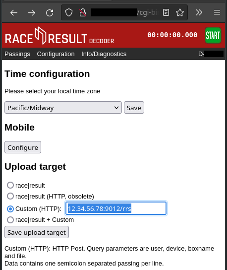

# rrrelay

Relay transponder passings from Race Result Decoder and Track Box units
to telegraph as timer messages:

	INDEX;SOURCE;CHANNEL;REFID;TOD;DATE

   - INDEX : passing sequence number (set by the relay)
   - SOURCE : decoder ID or nickname
   - CHANNEL : loop id or timing channel
   - REFID : transponder unique ID
   - TOD : local time of day string eg 13h27:52.4321
   - DATE : date of passing  eg 2023-02-27

## Configuration

Configuration is via metarace sysconf section 'rrrelay' with the
following keys:

key		|	(type) Description [default]
---		|	---
port		|	(int) HTTP listen port [53037]
passtopic	|	(string) MQTT relay topic for passings ['timing/data']
statustopic	|	(string) MQTT relay topic for status ['timing/status']
qos		|	(int) qos value for passing messages [2]
userid		|	(string) optional RR customer ID ['']

## Decoder Setup

### Race Result System

Open the decoder web interface and select the "Configuration" link.
Under "Upload target" select the option "Custom (HTTP)",
and enter the public ip, port and path to your rrrelay instance:

Then enable mobile upload on the decoder panel menu.

### Track Box

## Requirements

   - metarace >=2.0

## Installation

Install with pip:

	$ pip3 install rrrelay

